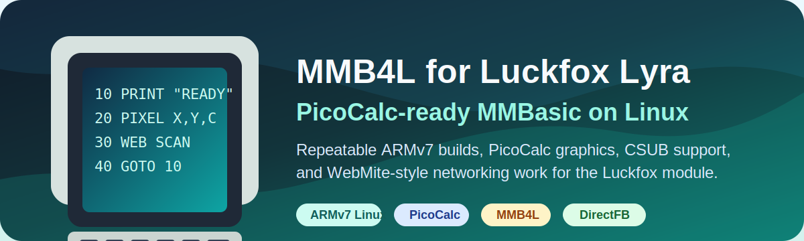

<p align="center">
  
</p>

<h1 align="center">MMB4L for Luckfox Lyra PicoCalc</h1>

<p align="center">
  PicoCalc-ready MMBasic on Linux with repeatable ARMv7 builds, graphics support, CSUB runtime work, and WebMite compatibility notes.
</p>

<p align="center">
  <code>ARMv7 Linux</code>
  <code>Luckfox Lyra</code>
  <code>PicoCalc</code>
  <code>MMB4L</code>
  <code>DirectFB</code>
</p>

This repository is a repeatable build and documentation workspace for running
MMB4L on a PicoCalc upgraded with a Luckfox Lyra Linux module.

MMB4L itself is not owned by this project. The source is included as a Git
submodule at `mmb4l/` and points to the upstream project by Thomas Hugo
Williams:

- Upstream MMB4L: https://github.com/thwill1000/mmb4l
- Upstream sptools submodule: https://github.com/thwill1000/mmbasic-sptools

This repository adds setup notes, build tooling, PicoCalc target notes, and a
place for project-specific patches. It is intended to make the process usable
and repeatable for other people, not just for one local machine.

## Current Status

- Upstream `mmb4l` is tracked as a submodule.
- `sptools` is tracked through upstream `mmb4l`.
- The target device has been observed as Buildroot 2024.02, ARMv7 hard-float,
  glibc 2.38, framebuffer `/dev/fb0`, evdev keyboard input, and ALSA audio.
- The first milestone is a stock or lightly patched ARM hard-float `mmbasic`
  build that can run on the PicoCalc from ADB.
- PicoMite firmware sources are not part of this repository.

## Clone

Use `--recurse-submodules`:

```powershell
git clone --recurse-submodules <this-repo-url>
Set-Location .\mmbasic-4-luckfox-lyra
```

If you already cloned without submodules:

```powershell
git submodule update --init --recursive
```

To verify the source checkout:

```powershell
git submodule status --recursive
git -C .\mmb4l remote -v
git -C .\mmb4l status --short --branch
```

## Windows ADB Setup

See [docs/setup/windows-adb.md](docs/setup/windows-adb.md).

Quick check:

```powershell
adb devices -l
```

## WSL Cross Compiler Setup

See [docs/setup/wsl-cross-compiler.md](docs/setup/wsl-cross-compiler.md).

Quick setup/check from Windows:

```powershell
$wslRepo = (wsl.exe wslpath -a (Get-Location).Path).Trim()
wsl.exe -d Ubuntu-22.04 -- sh -lc "cd '$wslRepo' && bash scripts/setup-wsl-cross-compiler.sh"
```

Quick check:

```powershell
$wslRepo = (wsl.exe wslpath -a (Get-Location).Path).Trim()
wsl.exe -d Ubuntu-22.04 -- sh -lc "cd '$wslRepo' && bash scripts/find-wsl-toolchain.sh"
```

## Environment Check

Run:

```powershell
powershell -ExecutionPolicy Bypass -File .\scripts\check-environment.ps1
```

The checker verifies Git state, submodules, ADB visibility, WSL, and the ARM
cross compiler. It does not fake missing tools or device data.

## ABI Probe

Before building MMB4L, confirm that the WSL compiler can produce a binary that
runs on the PicoCalc:

```powershell
powershell -ExecutionPolicy Bypass -File .\scripts\run-armhf-probe.ps1
```

Expected target output:

```text
probe_exit:42
```

## Build MMBasic

Build the MMB4L `mmbasic` target with the Luckfox SDK toolchain:

```powershell
powershell -ExecutionPolicy Bypass -File .\scripts\build-mmbasic.ps1
```

See [docs/build-mmbasic.md](docs/build-mmbasic.md).

## Compiled Binary

A compiled ARMv7 Luckfox/PicoCalc binary is included at
`dist/mmbasic-luckfox-lyra-armv7l`. Its checksum is recorded in
`dist/SHA256SUMS`.

For users who do not want to build from source, use the install-ready release
bundle:

```text
dist/mmbasic-luckfox-lyra-release.tar.gz
```

Copy it to the PicoCalc, unpack it, and install:

```sh
tar xzf mmbasic-luckfox-lyra-release.tar.gz
cd mmbasic-luckfox-lyra-release
sh install-picocalc.sh
mmb4l-run-tests
```

The bundle includes `mmbasic`, `mmb4l-run-tests`, examples, upstream tests,
PicoCalc target tests, `sptools`, and the proven `/etc/directfbrc`
configuration. It also applies the current `/dev/fb0` and `/dev/tty0`
permission workaround unless `MMB4L_APPLY_DEVICE_PERMS=0` is set.

Smoke test on the connected PicoCalc:

```powershell
powershell -ExecutionPolicy Bypass -File .\scripts\smoke-test-mmbasic.ps1
```

Install on the connected PicoCalc:

```powershell
powershell -ExecutionPolicy Bypass -File .\scripts\deploy-mmbasic.ps1
```

This installs `mmbasic`, upstream examples, upstream tests, `sptools`, and a
target-side `mmb4l-run-tests` script. See [docs/deploy.md](docs/deploy.md).

Refresh the standalone binary and release bundle after a local build:

```powershell
powershell -ExecutionPolicy Bypass -File .\scripts\package-release.ps1 -UseBuildBinary
```

## Patch Model

Project-specific source changes should be stored as patches under
`patches/mmb4l/` and applied to the submodule during build/setup. See
[patches/mmb4l/README.md](patches/mmb4l/README.md).

The release bundle also installs `mmb4l-check-basic`, a Python compatibility
scanner for checking BASIC files against the installed command/function set.
See [docs/basic-compatibility-checker.md](docs/basic-compatibility-checker.md).

If the patch queue grows into a long-lived source fork, the next clean step is
to fork `thwill1000/mmb4l`, point the submodule at that fork, and keep this
repository as the repeatable build/documentation wrapper.

## Important Docs

- [docs/source-provenance.md](docs/source-provenance.md)
- [docs/picocalc-target.md](docs/picocalc-target.md)
- [docs/roadmap.md](docs/roadmap.md)
- [docs/build-mmbasic.md](docs/build-mmbasic.md)
- [docs/deploy.md](docs/deploy.md)
- [docs/picocalc-repl-usage.md](docs/picocalc-repl-usage.md)
- [docs/patches.md](docs/patches.md)
- [docs/future-patches.md](docs/future-patches.md)
- [docs/luckfox-networking.md](docs/luckfox-networking.md)
- [docs/setup/windows-adb.md](docs/setup/windows-adb.md)
- [docs/setup/wsl-cross-compiler.md](docs/setup/wsl-cross-compiler.md)

## License And Attribution

This repository's original scripts and documentation can be licensed separately
when a project license is selected. Upstream MMB4L and sptools retain their own
licenses in the submodule:

- `mmb4l/LICENSE`
- `mmb4l/LICENSE.MIT`
- `mmb4l/LICENSE.MMBasic`
- `mmb4l/sptools/LICENSE`

Credit for MMB4L and sptools belongs to Thomas Hugo Williams and contributors
to the upstream repositories.
