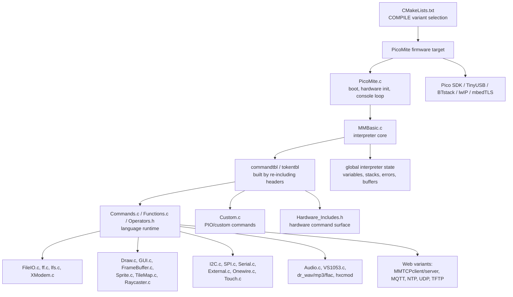

# PicoMiteAllVersions Code Structure Report

Date: 2026-06-22

Scope: static review of the current repository layout, build configuration, source organization, and coupling patterns. This report does not judge firmware correctness; it describes how the code is organized and where maintainability risk lives.

## Executive Summary

This repository is organized, but it is not modular in the modern sense. It is a large embedded C firmware tree built around a central MMBasic interpreter, a broad hardware abstraction surface, many compile-time variants, and substantial shared global state.

The code is best understood as a legacy-style embedded firmware monolith:

- Feature areas are mostly split into separate `.c` files.
- The build system decides which board and feature set to compile.
- Most subsystems share interpreter and hardware state through umbrella headers.
- Commands and functions are registered through macro-controlled header inclusion.
- Variant behavior is controlled by CMake source selection and preprocessor definitions.

That structure can ship working firmware, especially on constrained microcontrollers, but it is hard to reason about, hard to test, and easy to break when adding variants or touching shared headers.

## High-Level Block Diagram

## Repository Shape

The repository root is a flat firmware source tree. The root contains most C sources and headers, with user-facing PDF documentation under `docs/`, USB host configuration under `usb_host_files/`, and board manufacturing files under `Pico Computer/`.

Approximate source inventory from this checkout:

| Type | Count |
| --- | ---: |
| `.c` | 74 |
| `.h` | 80 |
| `.py` | 4 |
| `.bat` | 3 |
| `.pio` | 2 |
| `.bas` | 2 |
| `.S` | 1 |
| `.cmake` | 1 |

Largest first-party source modules by line count:

| File | Approx. lines | Primary role |
| --- | ---: | --- |
| `Commands.c` | 10.8k | Core MMBasic commands and flow control |
| `MM_Misc.c` | 9.9k | Timers, options, utility/runtime commands |
| `Editor.c` | 9.0k | Built-in editor and file manager behavior |
| `PicoMite.c` | 7.8k | Boot, board init, console, hardware integration |
| `MMBasic.c` | 7.2k | Interpreter, tokenization, execution, variables |
| `FileIO.c` | 7.2k | File command integration |
| `Draw.c` | 6.7k | Drawing primitives and graphics command support |
| `External.c` | 6.3k | GPIO, external IO, pin-related functionality |
| `MATHS.c` | 4.6k | Math commands/functions |
| `GUI.c` | 4.4k | GUI controls and display support |

Large vendored or library-style files such as `ffunicode.c`, `ff.c`, `lfs.c`, `dr_flac.h`, `dr_wav.h`, and `dr_mp3.h` should be treated differently from project-owned modules.

## Runtime Organization

Startup enters through `PicoMite.c`, whose `main()` handles board and runtime setup. The interpreter is initialized and run through `MMBasic.c`.

Important interpreter responsibilities:

- `InitBasic()` initializes command/token table sizes and interpreter state.
- `tokenise()` converts user input/program text into tokenized form.
- `ExecuteProgram()` walks tokenized program memory and dispatches commands.
- `commandtbl` and `tokentbl` are built by defining table-generation macros and re-including headers.

The dispatch path is compact and fast, but not easy to navigate:

1. User line or saved program enters interpreter buffers.
2. `tokenise()` rewrites text into token stream.
3. `ExecuteProgram()` scans token stream.
4. Command tokens index into `commandtbl`.
5. Function pointer dispatch calls `cmd_*`, `fun_*`, or `op_*` handlers.

## Build Organization

`CMakeLists.txt` is the real architecture map for variants. It defines:

- Valid `COMPILE` values.
- Common source files.
- Feature source groups such as display, web, cache, USB host, Bluetooth, Raycaster, and Turtle.
- Board selection from `COMPILE`.
- Compile definitions that drive conditional C code.
- Link libraries for Pico SDK, TinyUSB, BTstack, lwIP, and mbedTLS.

This is an improvement over ad hoc source inclusion, but it also means there are two architecture layers:

- CMake decides which files and defines are present.
- C preprocessor checks decide which code inside those files is active.

When those layers drift, variants can silently break.

## Coupling and Maintainability Findings

### 1. Umbrella Headers Create Broad Coupling

Most modules include `MMBasic_Includes.h` and `Hardware_Includes.h`. That gives each module visibility into broad interpreter and hardware state. It lowers friction when adding features, but it weakens module boundaries and makes dependency impact hard to predict.

### 2. Shared Global State Is Extensive

Many subsystems expose or consume globals through `extern` declarations. `Hardware_Includes.h` and `Commands.h` are especially broad. This is common in embedded firmware, but it makes tests and local reasoning difficult because functions often depend on implicit process-wide state.

### 3. Command Registration Is Clever but Brittle

The command and token tables are generated by re-including headers under macro modes. This avoids duplicate registry data, but it is non-obvious and makes tools, search, refactoring, and review harder.

### 4. Files Are Feature-Oriented but Too Large

There is a recognizable feature split, but many files carry too much responsibility. `Commands.c`, `MM_Misc.c`, `Editor.c`, `PicoMite.c`, and `MMBasic.c` are large enough that unrelated changes can collide.

### 5. Variant Complexity Is High

The supported board/feature matrix is broad: RP2040, RP2350, USB host, Web/WiFi, Bluetooth console, BLE HID host, VGA, HDMI, GUI controls, Raycaster, cache, structs, and memory-budget differences. CMake has comments that explain many edge cases, which is valuable, but the complexity still creates regression risk.

### 6. Testing Surface Appears Thin

No conventional unit test or CI test layout was evident from the static tree. For firmware this is common, but the interpreter core and command parser would benefit from host-side tests or golden program fixtures.

## What Is Good

- Feature files are recognizable by name.
- `CMakeLists.txt` validates `COMPILE` and derives board settings.
- Many variant-specific CMake comments explain hard-earned constraints.
- The project has user-facing PDF manuals for several subsystems.
- The code is optimized for constrained firmware realities rather than desktop-style purity.

## What Makes People Complain

The complaints are probably about maintainability, not necessarily firmware behavior:

- Too much global state.
- Too much conditional compilation.
- Very large source files.
- Non-obvious command table generation.
- Flat root directory with mixed app, driver, library, tooling, and asset files.
- Implicit dependencies through umbrella headers.
- Hard-to-test command handlers that operate through shared globals.

## Practical Recommendation

Do not start with a rewrite. Start by adding structure around the existing code:

1. Keep the current behavior intact.
2. Document module ownership and variant responsibilities.
3. Add a variant build matrix and build-smoke script.
4. Extract command registration metadata only after tests exist.
5. Reduce umbrella-header dependency gradually in files already being changed.
6. Add host-side tests for tokenization, command lookup, string/math functions, and variant metadata.

The highest value work is not reformatting or broad refactoring. The highest value work is making variant behavior explicit, testable, and reviewable.

